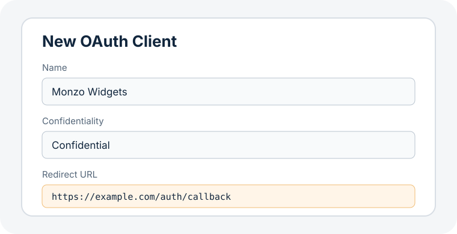
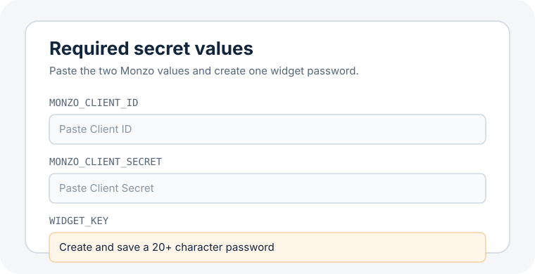
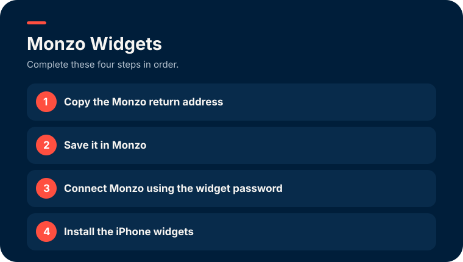
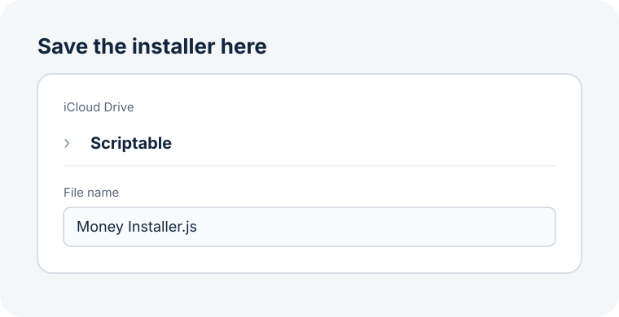

# Install Monzo Widgets on an iPhone

Follow these steps in order. You do not need a computer or any coding
knowledge. The first setup normally takes 15–20 minutes.

## Before you start

Install or create these first:

1. [Scriptable from the App Store](https://apps.apple.com/app/scriptable/id1405459188)
2. A free [GitHub account](https://github.com/signup)
3. A free [Cloudflare account](https://dash.cloudflare.com/sign-up)
4. Access to your Monzo app and email

GitHub is only used by Cloudflare to copy the widget code. You do not need to
upload anything or understand how GitHub works.

Keep all passwords and keys created below private.

## Step 1: Create the Monzo connection

1. Open [developers.monzo.com](https://developers.monzo.com/) in Safari.
2. Sign in with Monzo.
3. Tap **New OAuth Client**.
   Monzo uses “OAuth Client” to mean a private app connection.
4. Enter these details:

   - **Name:** `Monzo Widgets`
   - **Confidentiality:** `Confidential`
   - **Redirect URL:** `https://example.com/auth/callback`

5. Save the client.
6. Copy the **Client ID** somewhere safe.
7. Copy the **Client Secret** somewhere safe.

The `example.com` address is temporary. Do not open it. You will replace it
with the real address in Step 3.

<details>
<summary>Show what the Monzo form should contain</summary>



</details>

## Step 2: Create the private widget service

Tap this button:

[](https://deploy.workers.cloudflare.com/?url=https://github.com/alixkyle/monzo-widgets/tree/main/worker)

Then:

1. Sign in to GitHub if asked.
2. Sign in to Cloudflare if asked.
3. Allow Cloudflare to copy `monzo-widgets`.
4. Keep the suggested names.
5. Cloudflare will ask for three private values. Enter:

   - **MONZO_CLIENT_ID:** the Client ID copied in Step 1
   - **MONZO_CLIENT_SECRET:** the Client Secret copied in Step 1
   - **WIDGET_KEY:** a new private widget password

6. For `WIDGET_KEY`, use Safari's suggested strong password if it appears.
   Otherwise open the Passwords app, add an entry named `Monzo Widgets`, and
   use a generated password containing at least 20 characters.
7. Save the widget password. You must use exactly the same password later.
8. Finish the deployment and wait for Cloudflare to show that it succeeded.
9. Open the new address ending in `.workers.dev`.

You should now see a page headed **Monzo Widgets**.

<details>
<summary>Show the three Cloudflare values</summary>



</details>

<details>
<summary>Show the Monzo Widgets setup page</summary>



</details>

## Step 3: Add the real Monzo redirect address

This step replaces the temporary `example.com` address.

1. On the **Monzo Widgets** page, tap **Copy** beside
   **Copy the Monzo return address**.
2. Check that the copied address ends in `/auth/callback`.
3. Return to [developers.monzo.com](https://developers.monzo.com/).
4. Open the `Monzo Widgets` client created in Step 1.
5. Delete `https://example.com/auth/callback`.
6. Paste the new Cloudflare address in its place.
7. Save the Monzo client.

Do not continue until `example.com` has been replaced.

## Step 4: Connect your Monzo account

1. Return to the Cloudflare address ending in `.workers.dev`.
2. Enter the widget password (`WIDGET_KEY`) saved in Step 2.
3. Tap **Connect Monzo**.
4. Open the sign-in link Monzo sends by email.
5. Open the Monzo app when asked.
6. Approve the access request.

The browser should confirm that Monzo is connected.

## Step 5: Install the Scriptable widgets

1. Open Scriptable once so it finishes setting itself up, then return to Safari.
2. Go back to the Cloudflare address ending in `.workers.dev`.
3. In **Step 4** on that page, tap **Copy installer script**. The button turns
   green and says **Copied**.
4. Open Scriptable.
5. Tap the blue **+** button at the top right. A blank script opens.
6. Press and hold in the empty script area, then tap **Paste**.
7. Tap **Done** at the top left.
8. Press and hold the new script's tile, tap **Rename**, and name it
   `Monzo Installer`.
9. Open **Monzo Installer** and tap the triangular Run button.
10. When asked for the **Worker URL**, enter the Cloudflare address ending in
    `.workers.dev`. Do not add `/auth/callback`.
11. When asked for the **Widget key**, enter the same `WIDGET_KEY` saved in
    Step 2.
12. Tap **Verify and install**.

If the paste is very long, that is normal — it is the whole installer.

<details>
<summary>Show the copy and paste steps</summary>



</details>

The installer will add:

- `Monzo Today`
- `Monzo Spending`
- `Monzo Categories`
- `Monzo 4 Weeks`
- `Monzo Bills & Savings`
- `Monzo Balances & Pots`
- `Monzo Settings`

You do not have to use them all. Put the ones you like on the Home Screen and
ignore the rest.

It also checks the Monzo connection, balance, weekly spending, four-week
spending, pots, installed scripts, and saved settings. Continue when it says
**Everything is ready**.

Run **Monzo Settings** if you want to review the recommended defaults.

## Step 5b: Turn on automatic updates

Do this once. It keeps your widget service current, so future widgets always
have something that understands them.

1. Return to your `.workers.dev` page.
2. Scroll to **Turn on automatic updates**.
3. If it already says **✓ Up to date** and you have done this before, skip the
   rest.
4. Tap **Copy the auto-update file**.
5. Open your copy of `monzo-widgets` on [github.com](https://github.com) — it
   has the same name as this project and sits under your own account.
6. Tap **Add file**, then **Create new file**.
7. For the name, type exactly:
   `.github/workflows/sync-upstream.yml`
8. Paste into the large box, then tap **Commit changes**.
9. Open the **Actions** tab. If a green button offers to enable workflows, tap
   it.

Your service now updates itself once a day.

## Step 6: Put the widgets on the Home Screen

Add each widget separately:

1. Long-press an empty area of the Home Screen.
2. Tap **Edit**, then **Add Widget**.
3. Search for **Scriptable**.
4. Choose a size and tap **Add Widget**.
5. Long-press the new widget.
6. Tap **Edit Widget**.
7. Tap **Script**, then select the matching Money script.

Recommended sizes:

| Script | Size |
| --- | --- |
| `Monzo Today` | Small or medium |
| `Monzo Spending` | Medium |
| `Monzo Categories` | Medium |
| `Monzo 4 Weeks` | Medium |
| `Monzo Bills & Savings` | Medium |
| `Monzo Balances & Pots` | Small |

Setup is complete.

### Which weekly chart to choose

`Monzo Spending` and `Monzo Categories` show the same seven days and the same
total. Pick whichever split is more useful:

| Script | Each bar is split by |
| --- | --- |
| `Monzo Spending` | How the money left the account: card, transfers, Flex |
| `Monzo Categories` | Monzo's own categories: eating out, groceries, transport |

`Monzo Categories` names the five biggest categories of the week and groups the
rest as **Other**, so the legend stays readable. The colours match the ones in
the Monzo app's Spending tab.

### See four weeks at once

`Monzo 4 Weeks` is a single medium widget showing the last four weeks as four
bars, coloured by the same categories. Add it the same way as any other widget.

If you would rather swipe through the weeks one at a time, you can stack four
copies of a weekly widget instead:

1. Add four **medium** Scriptable widgets.
2. Edit each widget and choose `Monzo Spending` or `Monzo Categories`.
3. In **Parameter**, enter `0` on the first, `1` on the second, `2` on the
   third, and `3` on the fourth.
4. Long-press the Home Screen, then drag the four widgets on top of one another
   to make a widget stack.
5. Swipe up or down on the stack to move through the weeks.

`0` is the current seven-day period, `1` is the previous period, and so on.
Keep them ordered `0`, `1`, `2`, `3` in the stack. You can repeat the same
steps with `Monzo Bills & Savings`.

## Change the settings later

Open Scriptable and run **Monzo Settings**. The options are grouped into:

- **Monzo account**
- **Today & Spending**
- **Balances & Pots**
- **Advanced transaction handling**

Monzo Today and all the spending charts use the same rules, so today's headline
matches today's bar in every one of them.

## Install updates later

There are two halves to keep current, and they update in different ways.

**The widgets on your phone.** Run **Monzo Installer** again. It refreshes the
scripts without touching your Worker connection or preferences. If you
previously used the older `Money…` script names, edit each Home Screen widget
once and select its new `Monzo…` name.

**Your private widget service.** Once **Step 5** on your `.workers.dev` page is
done, this updates itself daily and there is normally nothing to do.

Open your `.workers.dev` address any time to see where it stands. Step 5 shows
one of:

- **✓ Up to date** — nothing to do
- **Update available** — follow the rest of this section

To pull an update immediately instead of waiting for the daily check:

1. Open your copy of `monzo-widgets` on [github.com](https://github.com).
2. Tap **Actions**.
3. Choose **Sync worker from upstream** in the left-hand list.
4. Tap **Run workflow**, then **Run workflow** again to confirm.
5. Wait a couple of minutes for Cloudflare to redeploy.

If **Actions** shows a button offering to enable workflows, tap it once. GitHub
turns scheduled jobs off in new copies until you approve them, and pauses them
again after 60 days with no activity — the same button brings them back.

**If there is no "Sync worker from upstream" in the Actions list**, the file
never made it into your copy. Go back to Step 5 on your `.workers.dev` page and
add it, then this section will work from then on.

If a widget shows **"Your widget service needs updating"**, or the installer
stops with **"Update your widget service"**, this is what they mean: the phone
has newer widgets than the service they are calling. Sync it and try again.

## If something goes wrong

**Monzo says the redirect URL is wrong**

Copy the Monzo Redirect URL from the Cloudflare page again. It must end in
`/auth/callback` and must exactly match the address saved at
[developers.monzo.com](https://developers.monzo.com/).

**The Worker says Unauthorised**

The `WIDGET_KEY` entered on the Cloudflare page does not exactly match the one
created in Step 2.

**I lost the widget password**

Nobody can look the old one up, but you can safely replace it. Your Monzo
connection is stored separately, so you do not have to connect Monzo again.

1. Open [dash.cloudflare.com](https://dash.cloudflare.com/) and sign in.
2. Tap **Compute (Workers)**, then open your `monzo-widgets` Worker.
3. Tap **Settings**, then **Variables and Secrets**.
4. Find `WIDGET_KEY` and tap **Edit**.
5. Enter a new password of at least 20 characters and save it in the Passwords
   app under `Monzo Widgets` before continuing.
6. Save the change and wait for Cloudflare to finish deploying.
7. Open Scriptable, run **Monzo Installer**, and enter the new widget password
   when it asks for the **Widget key**. Leave the Worker URL as it is.
8. Tap **Verify and install**.

The widgets will use the new password from their next refresh.

**The widgets show the wrong account**

If you hold a joint account as well as a personal one, Monzo decides which it
lists first, and the widgets follow that unless you tell them otherwise.

1. Open Scriptable and run **Monzo Settings**.
2. Tap **Monzo account**.
3. Tap the account you want. A tick marks the one in use.
4. Tap **Done**, then open each widget's script once to refresh it.

Every widget reads the same account, including balances and pots.

**Nothing happens when I tap Connect Monzo**

Older versions of the widget service could not open the Monzo sign-in page from
that button. Deploy the service again using the button in Step 2 to pick up the
fix, keeping the same names and the same three private values.

To connect straight away without redeploying, open this address in Safari,
replacing both capitalised parts:

```
https://YOUR-WORKER.workers.dev/auth?key=YOUR-WIDGET-PASSWORD
```

Clear that page from Safari's history afterwards, because the address contains
your widget password.

**Monzo returns 403**

Open the Monzo app and approve the developer access request.

**Monzo Installer cannot verify the connection**

Check that:

- Monzo was connected successfully in Step 4.
- The Worker URL ends in `.workers.dev` with nothing after it.
- The widget key is exactly the same as the `WIDGET_KEY` entered in Cloudflare.

**A widget looks out of date**

iOS chooses when Home Screen widgets refresh. Open its script in Scriptable
and run it to request fresh data immediately.
